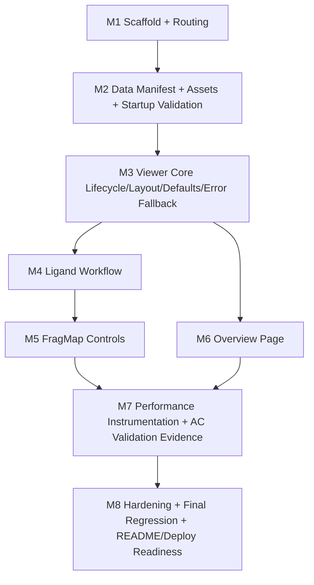

# Execution Plan: SILCS FragMaps Demo

## 1. Execution Strategy Summary
- Execute features in strict dependency order so each milestone validates a stable base for the next.
- Gate progression with explicit stop/go criteria: no milestone starts until the prior milestone exit gate passes.
- Validate both happy paths and failure paths at each milestone to reduce late-stage integration risk.
- Keep runtime behavior aligned to `docs/specs/*.md`; do not add out-of-scope features during execution.
- Prioritize observability early (timing hooks, error capture) so AC validation is incremental, not end-loaded.
- Use production-like validation for performance-sensitive behavior and preserve reproducible run conditions.
- Treat unresolved ambiguities as explicit assumptions in this document and resolve before affected milestone starts.

## 1.1 Testing Stack Decision (Locked)
- Primary automation framework: Playwright.
- Browser targets for automated gates:
  - Chromium: required for all milestone gate runs.
  - WebKit: required for pre-final cross-browser checks.
- Final AC sign-off policy:
  - Real Safari (latest stable) is required for final AC validation evidence in `docs/validation.md`.
  - Playwright WebKit is supporting evidence and early warning, not a substitute for final Safari sign-off.

Test project structure:
- `tests/e2e/milestones/`
  - Milestone gate specs (M1..M8) aligned to this execution plan.
- `tests/e2e/ac/`
  - AC-specific validation specs (`ac1.spec.ts` ... `ac6.spec.ts`).
- `tests/e2e/helpers/`
  - Shared route helpers, selectors, timing utilities, and error-capture hooks.
- `playwright.config.ts`
  - `chromium` and `webkit` projects, base URL, retries, trace/video policy.

Command contract:
- `npm run test:e2e:chromium`
  - Runs milestone/feature gates in Chromium.
- `npm run test:e2e:webkit`
  - Runs milestone/feature gates in WebKit for cross-browser parity checks.
- `npm run test:ac:chromium`
  - Runs AC-focused Playwright suite in Chromium with timing capture.
- `npm run test:ac:webkit`
  - Runs AC-focused Playwright suite in WebKit as pre-final Safari signal.
- `npm run test:e2e:report`
  - Opens or exports Playwright HTML report artifacts.

Evidence contract:
- Every milestone gate must attach Playwright run output (pass/fail + key logs) to implementation notes.
- AC evidence in `docs/validation.md` must include:
  - Playwright timing output for Chromium/WebKit runs.
  - Separate real-Safari final run results for required AC sign-off.

## 1.2 Validation Execution Context Policy (Locked)
- Authoritative gate evidence comes from local host-terminal runs where Node/npm/tooling are installed.
- Agent-side command attempts are still useful for early signal, but if tooling is unavailable they must be recorded as `ENV-BLOCKED`, not `FAIL`.
- A milestone may be marked `PASS` only after required local commands (for example `npm run validate:mX`) complete successfully and output is captured in milestone notes.
- If agent and local outcomes differ, local host-terminal outcomes are the source of truth and the discrepancy should be documented.

## 2. Milestone Dependency Diagram

## 3. Ordered Milestone Table
| Milestone ID | Feature scope | Depends on | Implement first (files/modules) | Test/validation steps | Exit gate (pass/fail criteria) | Risks and mitigations |
|---|---|---|---|---|---|---|
| M1 | Project scaffold + routing foundation (`/`, `/viewer`) | None | `package.json`, `tsconfig.json`, `src/main.ts`, `src/router/index.ts`, `src/App.vue`, `src/pages/HomePage.vue`, `src/pages/ViewerPage.vue` | 1. Build succeeds in production mode. 2. Route `/` renders without console errors. 3. Route `/viewer` renders without console errors. 4. Navigate `/` -> `/viewer` and back with no full page reload. 5. Negative check: unknown route does not crash app. | Pass only if build is green and both routes are reachable with client-side navigation and zero uncaught runtime errors. | Risk: stack drift from plan. Mitigation: lock to Vue 2 + TS + Vue Router + Vuex + Vuetify before coding features. |
| M2 | Data manifest + asset pipeline + startup data validation | M1 | `src/data/manifest.ts`, `src/viewer/loaders.ts`, `public/assets/protein`, `public/assets/ligands`, `public/assets/maps`, startup validation utility | 1. Manifest includes `3fly_cryst_lig` and all baseline ligand IDs from `from_silcsbio/ligands/*.sdf`. 2. Startup validation checks required protein/ligand/map assets. 3. Missing-asset simulation triggers non-blocking error and local control disable intent (not app crash). 4. Mapping check: FragMap IDs and labels match spec inventory exactly. | Pass only if manifest coverage, deterministic asset paths, and startup validation behaviors match specs with no blocking failures. | Risk: silent asset mismatch. Mitigation: deterministic manifest generation + explicit startup validation report. |
| M3 | Viewer core lifecycle/layout/default state/error fallback | M2 | `src/components/NglViewport.vue`, `src/components/ViewerTopBar.vue`, `src/components/ControlsPanel.vue`, `src/viewer/nglStage.ts`, viewer shell state store/module | 1. `/viewer` shows explicit loading state then ready state. 2. Default state: `3fly_cryst_lig`, baseline on, refined off, no maps visible. 3. Camera baseline snapshot constant exists and `Reset view` target is defined. 4. Resize preserves camera state. 5. Unmount/remount does not duplicate listeners. 6. Failure-path: forced stage init failure shows fallback message + retry/navigation option. 7. Desktop fullscreen layout keeps controls panel visible with no page-level horizontal overflow/clipping. | Pass only if viewer core acceptance checks in `docs/specs/viewer-core-spec.md` are satisfied and failure fallback works. | Risk: lifecycle leaks and layout regressions under desktop viewport stress. Mitigation: teardown assertions, remount smoke test, and explicit desktop layout overflow checks in milestone gate. |
| M4 | Ligand workflow (featured + searchable list, 4 pose states, zoom, empty/error handling) | M3 | `src/components/LigandControls.vue`, ligand store/actions, pose component management in `src/viewer/reps.ts` | 1. UI contains quick picks, searchable dropdown, baseline/refined checkboxes, zoom. 2. Supports baseline-only/refined-only/both-visible/both-unchecked. 3. Both-unchecked shows persistent empty-state with recovery actions. 4. Search behavior: case-insensitive matching, deterministic ordering, `No ligands found` state. 5. Switching ligands and pose states is in-place (no reload). 6. Failure-path: per-pose load failure disables only affected pose and shows toast. | Pass only if ligand workflow acceptance checks in `docs/specs/ligand-workflow-spec.md` pass, including manifest ordering and error/empty-state behavior. | Risk: pose-switch race conditions. Mitigation: cancel stale load intents and preserve previous valid rendered state on hard failures. |
| M5 | FragMap controls (Primary/Advanced, per-map toggles, per-map iso, exclusion behavior, retry/failure isolation) | M4 | `src/components/FragMapControls.vue`, map store/actions, map rep update logic in `src/viewer/reps.ts` | 1. Panel shows Primary 3 + expandable Advanced list with canonical labels/colors. 2. All maps hidden by default; lazy load on first toggle; cache reused on repeat toggles. 3. Per-map iso controls enforce numeric contract (`step`, `min`, `max`, precision, clamp/revert). 4. Exclusion map is visibility-toggleable with disabled iso and fixed style. 5. Bulk actions (`Hide all`, `Reset defaults`, `Reset view`) match spec. 6. Failure-path: row-level map failure isolation with retry; unaffected rows remain stable. | Pass only if FragMap acceptance checks in `docs/specs/fragmap-controls-spec.md` pass, including no global iso control and row-level failure isolation. | Risk: async race instability during rapid toggles/iso edits. Mitigation: request-id or single-flight guards per map row. |
| M6 | Overview page narrative + CTA + external links behavior | M3 | `src/pages/HomePage.vue`, shared link/button components if needed | 1. Narrative is exactly 1-2 paragraphs with required scientific/product concepts. 2. CTA `Go to Viewer` navigates client-side to `/viewer`. 3. Required external link is present and opens in new tab. 4. Failure-path: link open failure does not block page interaction or CTA navigation. | Pass only if overview acceptance checks in `docs/specs/overview-page-spec.md` pass. | Risk: content drift from spec. Mitigation: checklist review against required concepts before sign-off. |
| M7 | Performance instrumentation + AC-1..AC-6 validation evidence (`docs/validation.md`) | M5, M6 | `src/perf/metrics.ts`, instrumentation hooks in viewer/ligand/fragmap flows, `docs/validation.md`, README link | 1. Instrument AC-1/AC-2/AC-5 boundaries with `performance.now()`. 2. Run validation in production build for Chrome then Safari in fixed sequence AC-1..AC-6. 3. Record raw runs and medians; enforce strict per-run pass for AC-2 and AC-5. 4. Capture camera preservation checks for AC-2. 5. Capture runtime error summary for AC-6. 6. Failure-path: triage and re-run once for non-deterministic anomalies per validation spec. | Pass only if all AC-1..AC-6 pass per `docs/specs/performance-and-validation-spec.md`, `docs/validation.md` is complete, and README links to it. | Risk: late performance regressions. Mitigation: start instrumentation early and benchmark representative scenarios before full AC run. |
| M8 | Hardening, final regression pass, README/deploy readiness | M7 | Regression checklist artifact, final README updates, deployment config/scripts | 1. Full regression pass across `/` and `/viewer` on target browsers. 2. Re-run smoke tests for startup fallback, ligand/map failure isolation, and camera reset behavior. 3. Confirm no out-of-scope controls/features appear. 4. Confirm deploy artifact generation and local serve instructions in README. 5. Confirm evidence artifacts and final known-limitations notes are present. | Pass only if regression is clean, docs are complete, and deployment/readme/evidence artifacts are consistent and reproducible. | Risk: release-day drift. Mitigation: final freeze checklist and one-commit release candidate validation run. |

## 4. Stop/Go Checklist
Run this checklist at the end of each milestone before starting the next:
- All milestone-specific test steps executed and recorded.
- Exit gate criteria met with objective evidence (logs, screenshots, timings, or checklist output).
- Required local host-terminal validation command output is attached for the milestone gate (`validate:mX` or equivalent).
- No unresolved blocker-level defects remain open for this milestone.
- Failure-path tests for this milestone passed (not only happy path).
- No known behavior contradicts `docs/specs/*.md` or `docs/plans/technical-plan.md`.
- Any temporary workaround is documented with owner and resolution milestone.
- Git working state is reviewable and traceable to milestone scope.
- If gate fails, stop and resolve before proceeding.

## 5. AC Coverage Matrix
| AC | Milestone(s) implementing behavior | Validation step(s) | Primary evidence artifact |
|---|---|---|---|
| AC-1 (<=5s load) | M2, M3, M7 | Instrument route-mount-to-interactive boundary; run 3 cold-start runs per browser in production build. | `docs/validation.md` AC-1 table + raw timing samples |
| AC-2 (toggle <200 ms + camera preserved) | M5, M7 | Measure representative map toggles (`3fly.hbdon.gfe.dx`, `3fly.mamn.gfe.dx`), enforce per-run threshold and camera tolerance checks. | `docs/validation.md` AC-2 timings + camera checks |
| AC-3 (pose visibility in-place) | M4, M7 | Cycle all four pose states for selected ligand; verify no reload/navigation and no uncaught errors. | `docs/validation.md` AC-3 result notes |
| AC-4 (ligand switching in-place) | M4, M7 | Switch featured and non-featured ligands; verify pose controls remain functional and no reload/errors. | `docs/validation.md` AC-4 result notes |
| AC-5 (iso update <200 ms) | M5, M7 | Measure per-map iso updates on iso-adjustable GFE rows; enforce per-run threshold; exclude Exclusion map. | `docs/validation.md` AC-5 timings + notes |
| AC-6 (no uncaught runtime errors in 5-min exploration) | M3, M4, M5, M7, M8 | Run 5-minute exploratory scenario across maps, ligands, poses, and camera interactions in each browser. | `docs/validation.md` AC-6 error summary |

## 6. Open Assumptions and Unresolved Decisions
- Assumption: implementation uses Vue 2 + TypeScript + Vue Router + Vuex + Vuetify as defined in `docs/plans/technical-plan.md`.
- Assumption: runtime formats remain `.pdb` (protein), `.sdf` primary with `.pdb` fallback (ligands), `.dx` (FragMaps).
- Assumption: representative-map validation for AC-2 is sufficient, consistent with specs and technical plan.
- Assumption: exact camera baseline snapshot values will be finalized in implementation constants and reused by startup + `Reset view`.
- Resolved decision: Playwright is the required E2E/AC automation stack per Section 1.1.
- Unresolved decision: exact deployment command sequence (beyond GitHub Pages target) depends on scaffold tooling choices in M1.
